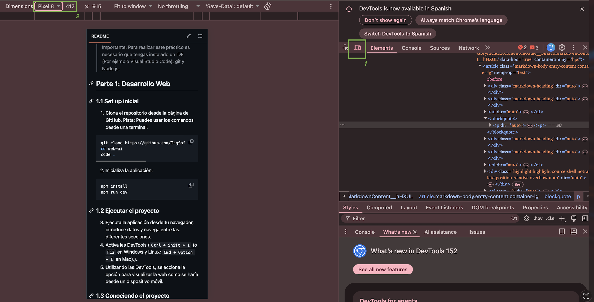
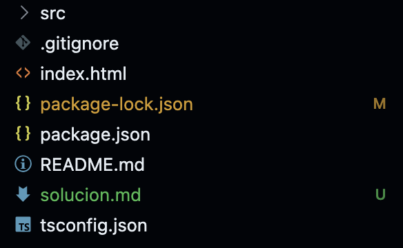
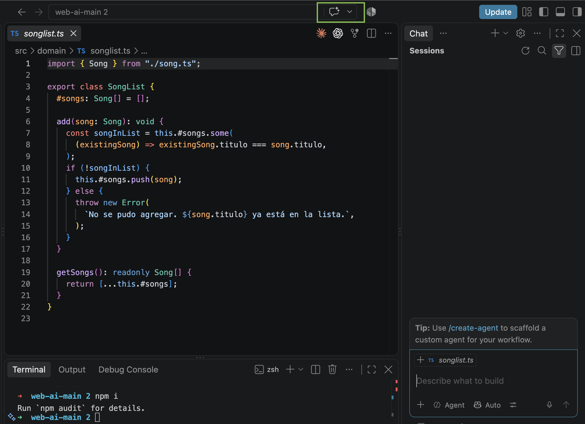

# Solución 

Esta solución es una guía. Pueden haber múltiples soluciones válidas (y distintas a las propuestas aquí) para cada una de las partes. 

## 1.1 Set up inicial

Aclaración:
El comando 'code .' puede no funcionar en MacOS. De forma alternativa, se puede ingresar a VSCode y abrir la carpeta desde allí.

## 1.2 Ejecutar el proyecto

Abrir las DevTools. Para ver en formato mobile, clickear en dónde está el ícono marcado como 1 en la siguiente imagen:

Se puede seleccionar el dispositivo en el dropdown marcado con el número dos en la imagen. Esto nos permitirá visualizar la web desde la resolución de algunos modelos de tablets o celulares.

## 1.3 Conociendo el proyecto

> ¿Qué lenguajes de programación se utilizan? ¿Cuál es la finalidad de uso de cada lenguaje?

Se utiliza:
TypeScript: se utiliza para implementar la lógica y el comportamiento de la aplicación.
HTML: se utiliza para definir la estructura y el contenido de las páginas web.
CSS: se utiliza para definir la presentación visual y los estilos de la interfaz (colores, tamaño de letra, etc).

Es importante que estén siempre bien divididos los archivos, por ejemplo, evitar definir colores en el archivo de HTML, o agregar lógica de negocio en items de HTML. 

Además, se utiliza Node.js como entorno de ejecución para ejecutar código JavaScript/TypeScript fuera del navegador y gestionar las dependencias y herramientas necesarias para el desarrollo del proyecto. En otras palabras, poder ejecutar el proyecto desde un navegador.

> ¿Cuál es la estructura de archivos y directorios de este proyecto?

Por estructura, nos referimos a los archivos de este repositorio:
.

En este caso, es importante destacar que se cuenta con la carpeta `src`. En la carpeta `src`, encontramos todo vinculado con el código fuente, es decir, el código de nuestra aplicación.

Dentro de esa carpeta `src`, tenemos las carpetas `domain` e `interface`. En dominio, se encuentran todos los archivos vinculados a la lógica de dominio, en otras palabras, las clases de Typescript que definirán el comportamiento de la aplicación. 

Luego, en la carpeta `interface` se encuentran todos los archivos vinculados a la visualización en la interfaz de usuario (lo que vemos en pantalla). En este caso, se guardarán archivos css, html y, un archivo `main.ts`, que actúa como punto de entrada a la aplicación y en este caso, como conector entre lo que definimos en el dominio y lo que mostramos en pantalla (vincular elementos HTML a métodos definidos en clases de TypeScript).

> ¿Cómo el sistema persiste la información? ¿Dónde se almacenan las canciones?

La información se almacena únicamente en memoria mientras la aplicación está en ejecución. Si se reinicia la ventana del navegador, se pierde la información.

Las canciones se representan como instancias de la clase `Song` y se guardan en el arreglo privado `#songs` de la clase `SongList`.

Cuando el usuario agrega una canción desde la interfaz, en `main.ts` se crea una nueva instancia de `Song` y se envía al método `add()` de `SongList`, que valida que no exista otra canción con el mismo título y, si es válida, la agrega al arreglo.

No se utiliza una base de datos ni `localStorage`, por lo que la información no persiste al recargar o cerrar la aplicación.

> ¿Qué campos son obligatorios? ¿Cómo se define y se muestra el mensaje de error?

El único campo obligatorio es el título de la canción.

Hay dos formas de definirlo:

- Por un lado, en el archivo de HTML se utiliza el atributo required. Se coloca en el campo de texto que es obligatorio
- Por otro lado:
Se puede realizar la validación dentro de un método de una clase. En este caso, en el setter del título en la clase Song. Si no se ingresó información, el método tira una excepción.

En main.ts, estas excepciones son capturados mediante try/catch y el mensaje correspondiente se muestra en la interfaz dentro del elemento add-songs-error-msg.

## 1.4 Modificando el proyecto

Ver commit que contiene los cambios: [Commit](https://github.com/msusviela/web-ai/commit/e8748f2cb60160ac6d5d71fe29e45c5cbe700ab0)

Las líneas en verde es lo que se agregó, lo que está en rojo lo que se eliminó.
Para ver los archivos completos, pueden seleccionar los 3 puntitos al lado del nombre del archivo y seleccionar `View file`. La solución abarca tanto la modificación del toString como el nuevo campo.

> **IMPORTANTE:** Para agregar el campo es necesario agregarlo al HTML, agregar el atributo nuevo a la clase Song y luego realizar las modificaciones necesarias en main.ts para que al guardar desde la interfaz de usuario, los datos queden persistidos correctamente. Además, fue necesario modificar el toString para mostrar el año en pantalla una vez guardada la canción.

## 1.5 Debuggeando con breakpoints en DevTools.

Un **breakpoint** es un punto de interrupción que se coloca en una línea de código para pausar temporalmente la ejecución del programa cuando llega a esa línea. Sirve para depurar (debuggear) el código, ya que permite observar los valores de las variables en ese momento dado y seguir la ejecución paso a paso. Por ejemplo, se puede colocar un breakpoint en la línea `mainSongList.add(newSong)` para detener la aplicación justo antes de agregar una canción y verificar qué valores tienen `newSong.titulo` y `newSong.artista`. En procesos largos, donde se modifican muchas veces las variables, nos puede servir para ver si hay algún punto en el que falla y se asigna un valor no deseado.

Se recomienda ver el siguiente video para aprender a cómo colocar breakpoints en DevTools.
El valor a visualizar debe ser el que se ingresó en el formulario.

[Breakpoints](https://www.youtube.com/watch?v=H0XScE08hy8&t=182s)

## Parte 2: Intro a IA

Para abrir Copilot, se puede clickear en el botón que aparece en VSCode:
.

Luego se abrirá el chat. Conviene verificar que esté la opción Agent seleccionada en ese chat, para asegurarse que tiene el agente. Allí escribir el prompt para agregar lo solicitado. Revisar los cambios, aceptar los adecuados y rechazar/modificar los que no apliquen. Volver a ejecutar, en caso de que sea necesario iterar con uno (o varios) prompts nuevos hasta lograr el resultado deseado.

Enlaces útiles para Copilot:
- [Configuración](https://code.visualstudio.com/docs/setup/copilot)
- [Introducción](https://docs.github.com/es/copilot/get-started/quickstart)
- [Teórico, buenas prácticas y recomendaciones IA](https://docs.google.com/presentation/d/1ytFjGOEnU6lygSCmktYf0MuLTJc8dI0MKEqaOdZgNjM/edit?usp=sharing)
